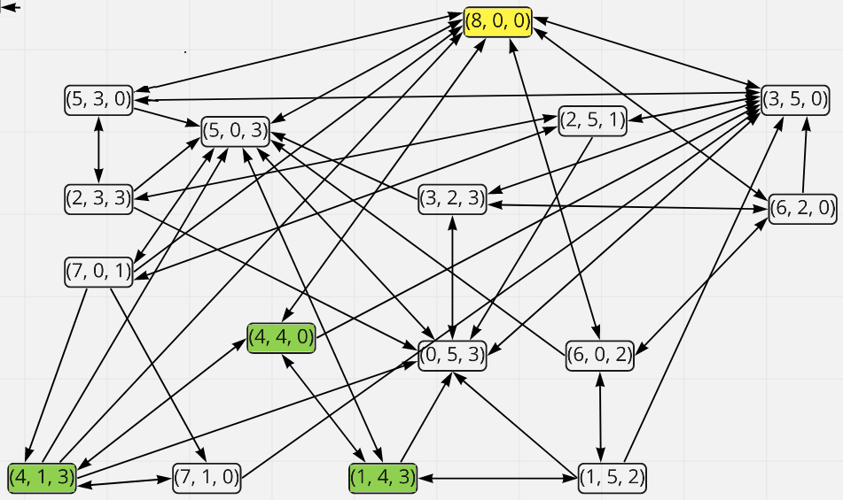

# UCS1504: Artificial Intelligence - Coursework

Programs, reports, documentation and screenshots implemented and designed for the laboratory coursework on UCS1504: Artificial Intelligence course.

## Exercises

1. [Performance, Environment, Actuator, Sensor (PEAS) Description Formulation](./E1-PEASDescriptions)
    - For a face-recognition-based smart attendance system
    - For an online autonomous proctoring system
    - For a collaborative robotic system of agents that can contest in soccer contests
    - Draw a house using primitives
    - [Report](./E1-PEASDescriptions/Report.pdf) 
      

2. [The Decantation Problem I](./E2-StateSpaceSearch(BFS))
    - State Space Representation Diagram
    - Solved with Breadth-first State Space Search (BFS)
    - [Documentation](./E2-StateSpaceSearch(BFS)/Documentation)
    - [Code on Replit](https://replit.com/@KarthikDesingu/Ex2-StateSpaceSearch-Decantation-Problem)
        
    
      

3. [The Eight Puzzle Problem](./E3-EightPuzzle)
    - Solved using the traditional Breadth First Search (BFS) approach
    - Solved using the Bidirectional Breadth First Search (Bi-BFS) approach
    - [Report](./E3-EightPuzzle/Documentation) 
      

4. [The Decantation Problem II](./E4-StateSpaceSearch(BiDirectional))
    - Solved using the Bidirectional Breadth First Search (Bi-BFS) approach
    - Solved using the Iterative Deepening Search approach
    - [Report](./E4-StateSpaceSearch(BiDirectional)/Documentation) 
      
    
